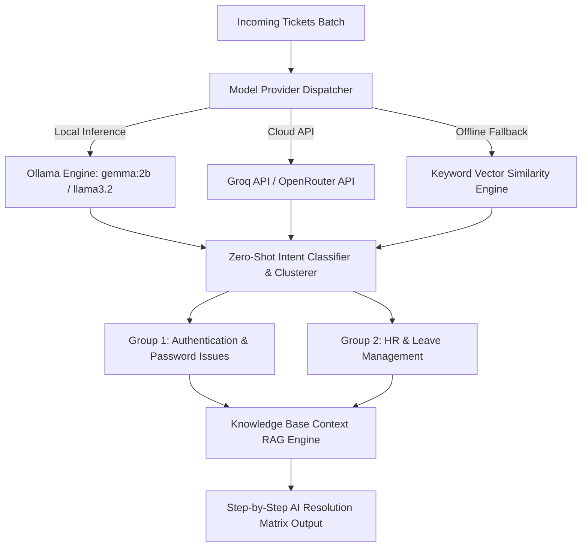
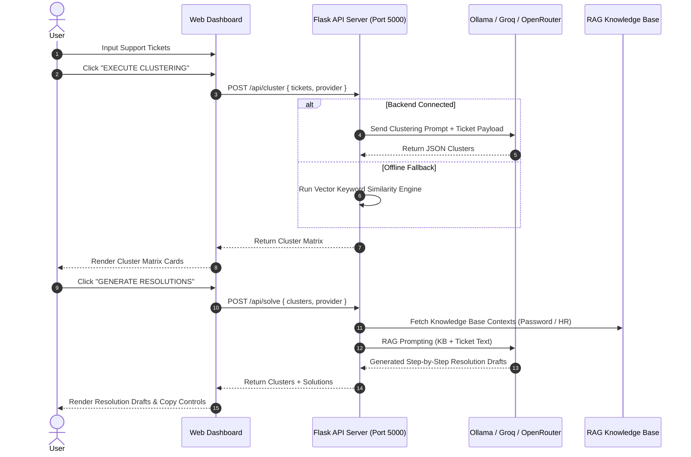

# AI Support Ticket Classification & Resolution System

## Overview & Architecture

The **NexusAI Ticket Studio** is an autonomous support ticket classification, clustering, and RAG resolution system. It processes incoming unstructured support requests, aggregates them into semantic clusters, and produces step-by-step resolution drafts.

---

## Processing Flowchart & System Interaction

---

## Features & Supported AI Backends

1. **Ollama (Local LLM)**: Zero-cost, offline local inference utilizing models like `gemma:2b` or `llama3.2`.
2. **Groq API**: High-speed cloud LLM execution (`llama-3.3-70b-versatile`).
3. **OpenRouter API**: Access to open-weights models (`meta-llama/llama-3-8b-instruct:free`).
4. **Deterministic Fallback Engine**: Guarantees zero downtime by utilizing keyword vector matching if remote or local LLM instances are unreachable.
5. **Editorial Monolithic UI**: High-contrast, non-generic dark charcoal (`#1A1A1A`) on off-white canvas (`#F4F4F2`) design adhering strictly to `Rules.md`.

---

## File Structure

- `app.py`: Flask HTTP REST API.
- `ai_engine.py`: Clustering algorithms, LLM prompt engineering, and RAG knowledge base.
- `index.html`: Editorial Monolithic layout.
- `style.css`: Monolithic grid tokens and typography.
- `app.js`: Interactive state management and API integration.
- `SKILL.md`: Design system specification for agent reuse.
